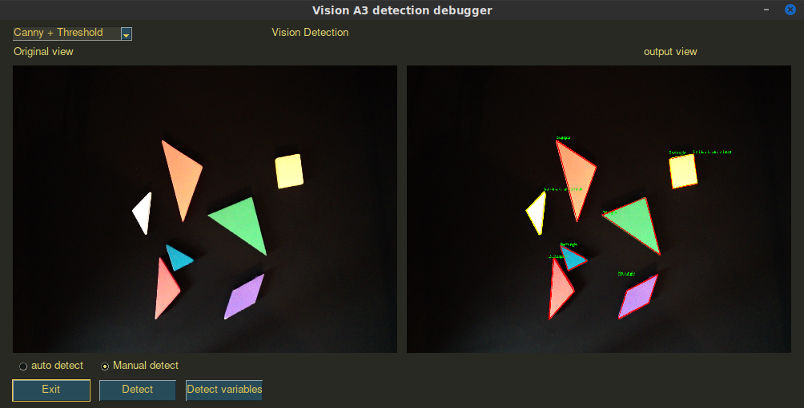
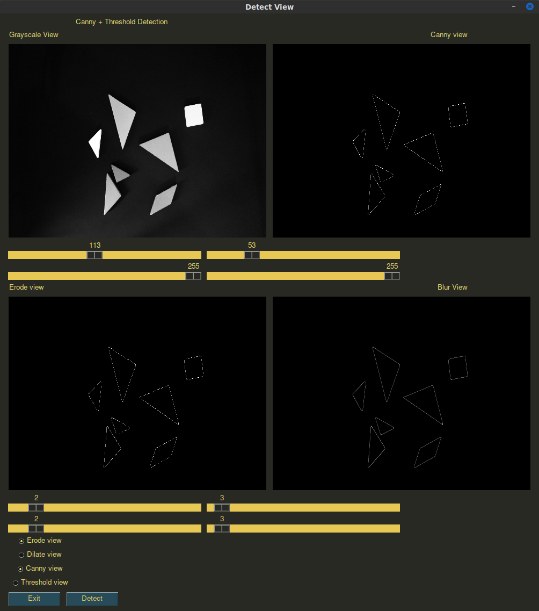

# Vision-Pick-and-Place

This project is used to detect shapes get the position and send that over an TCP connection to a PLC

## Settings file
Below is the settings file with all the variables that can be changed. This file can be manually edited, or the debug UI can be used.
Below is a small explanation what every settings variable does in the program.

```json
{
    "verbose": true,
    "capture_device": "/dev/video0",
    "webcam_settings": {
        "frame_width": 2000,
        "frame_height": 2000
    },
    "detection_settings": {
        "edge_detection_type": 2,
        "canny_threshold_A": 73.0,
        "canny_threshold_B": 255.0,
        "contour_threshold_A": 136.0,
        "contour_threshold_B": 255.0,
        "blob_threshold_A": 255,
        "blob_threshold_B": 255,
        "blur_threshold_A": 3,
        "blur_threshold_B": 3,
        "dilate_iterations": 4,
        "erode_iterations": 4,
        "contour_poly_threshold": 0.01
    },
    "block_colours": {
        "triangle_1": 16751733,
        "triangle_2": 7077525,
        "triangle_3": 16765604,
        "triangle_4": 16777215,
        "triangle_5": 1692394,
        "square": 16777144,
        "parallelogram": 14659839
    },
    "connection": {
        "TCP_IP": "127.0.0.1",
        "TCP_PORT": 5000
    },
    "use_test_image": false,
    "test_image": "./Image/Test_frame_1.bmp",
    "display_output": {
        "enable": true,
        "image_height": 360,
        "image_width": 480,
        "autodetect": 1
    }
}
```

If ```verbose``` is true the program wil print out all the detected shapes.

```capture_device``` is the device path to the webcam used by the program.

```json
    "webcam_settings": {
      "frame_widht": 2000,
      "frame_height": 2000
},
```
The webcam settings change the resolution that the webcam wil use in the program. If the number is higher than the maximum
supported resolution the program will use the maximum resolution.

```json
  "detection_settings": {
          "edge_detection_type": 2,
          "canny_threshold_A": 73.0,
          "canny_threshold_B": 255.0,
          "contour_threshold_A": 136.0,
          "contour_threshold_B": 255.0,
          "blob_threshold_A": 255,
          "blob_threshold_B": 255,
          "blur_threshold_A": 3,
          "blur_threshold_B": 3,
          "dilate_iterations": 4,
          "erode_iterations": 4,
          "contour_poly_threshold": 0.01
    },
```

The detection settings change threshold used in the program for the object detection.

```edge_detection_type``` will change which functions get used to detect the objects. Currently only type ```2``` works.

```canny_threshold_A``` Is one of the variables used in Canny edge detection. [doc](https://www.docs.opencv.org/master/da/d22/tutorial_py_canny.html)

```canny_threshold_B``` Is one of the variables used in Canny edge detection.

```contour_threshold_A``` Is one of the variables used to create threshold image. [doc](https://docs.opencv.org/master/d7/dd0/tutorial_js_thresholding.html)

```contour_threshold_B``` Is one of the variable used to create threshold image.

```blob_threshold_A``` Is one of the variables used in blob detection. (Not used) [doc](https://docs.opencv.org/master/d0/d7a/classcv_1_1SimpleBlobDetector.html)

```blob_threshold_A``` Is one of the variables used in blob detection.

```blur_threshold_A``` Variable used to create Ksize for blur. [doc](https://www.docs.opencv.org/master/dc/dd3/tutorial_gausian_median_blur_bilateral_filter.html)

```blur_threshold_A``` Variable used to create Ksize for blur.

```dilate_iterations``` Variable for how many dilate iterations should be used. [doc](https://docs.opencv.org/3.4/db/df6/tutorial_erosion_dilatation.html)

```erode_iterations``` Variable for how many erode iterations should be used. [doc](https://docs.opencv.org/3.4/db/df6/tutorial_erosion_dilatation.html)

```contour_poly_threshold``` Variable for how close the line to the curve stays/ [doc](https://docs.opencv.org/3.4/d3/dc0/group__imgproc__shape.html#ga0012a5fdaea70b8a9970165d98722b4c)

```json
    "block_colours": {
      "triangle_1": 16751733,
      "triangle_2": 7077525,
      "triangle_3": 16765604,
      "triangle_4": 16777215,
      "triangle_5": 1692394,
      "square": 16777144,
      "parallelogram": 14659839
},
```

This part stores every block colour as an 24-bit RGB value. the Json represents it as an int. 
The program splits the int in separate R, B and G values. These values are used to detect which triangle is which.

```json
    "connection": {
        "TCP_IP": "127.0.0.1",
        "TCP_PORT": 5000
    },
```

The IP and port used to communicate with the PLC.

```json
    "use_test_image": false,
    "test_image": "./Image/Test_frame_1.bmp",
```

If ```use_test_image``` is ```true``` the image located at the ```test_image``` wil be used as input for detection. 
The webcam will be disabled.

```json
    "display_output": {
        "enable": true,
        "image_height": 360,
        "image_width": 480,
        "autodetect": 1
    }
```

if ```enable``` is ```true``` the program wil launch an debug UI. this ui wil render the webcam frame and output detection frame.
This interface can help fine-tune all the detection variables used in the detection.

```image_height``` and ```image_width``` represent the height and width of the frames used to render the webcam en detection frames.
If the program doesn't fit on your screen lower these numbers.

If ```autodetect``` is ```1``` the program will try and detect shapes continuously this can help with fine-tuning the detection variables.
If it is set to ```0``` the webcam frame wil stay up to date, but the detection frames only update when the detect button is pushed.


## Debug UI
If the debug UI is enabled a window will appear on your screen. below is the window displayed



The left frame of the main window shows the live feed of the webcam. The right windows shows the final detected objects frame.

The top left has a drop down menu this menu wil change the ```edge_detection_type``` Currently only Canny+Threshold functionally works.

On the bottom left there is an option to change from manual detect to auto detect mode. Below there are three buttons.
The first "Exit" button wil exit the program. The second "Detect" button wil start the detection process if manual detect is selected.
The third "Detect variables" button will open a new window with more options to change the detection parameters.



This view displays all the parameters that can be changed to optimize the detection process.
The first frame shows the grayscale version of the webcam view. The second frame can be the Canny or Threshold view.
This can be changed in the bottom left. The third frame can be the Erode or Dialte view. This can also be changed in the bottom left.

The first two sliders change the ```contour_threshold_A``` and ```contour_threshold_B``` this is visible in the "Threshold view".

The second two slider change the ```canny_threshold_A``` and ```canny_threshold_B``` this will affect how sharp the lines will be.
This is visible in the "Canny view".

the third two slider change the ```dilate_iterations``` and ```erode_iterations``` this help with connect the
lines together if the canny function separated them. This is visible in the "Erode view" and "Dilate view"

the forth two slider change the ```blur_threshold_A``` and ```blur_threshold_B``` these values are used for the Ksize of the cv blur function.

Bellow there are also two buttons. The "exit" button will only close this separate window. The "Detect" button wil start a manual detect.


## TCP PLC connection

The IP and port used in the settings filed are used to receive a command to start detecting the objects and
return the position and orientation of that specific block. (not yet implemented)

## TODO

* Make the vision more robust, so you can be sure it detected the right blocks.
* Create the TCP PLC connection.
* Use the colour data to know which block is which.
* Create a calibrate function in the UI to get up to date colour data of the blocks.
* Clean up the UI and remove old detection functions
* Add a vision reference point to calculate the positioning of the blocks.
